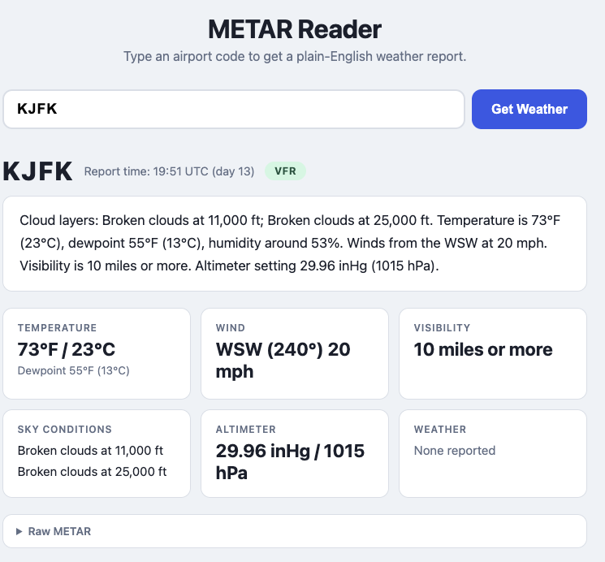

# METAR Reader

A web application that fetches live METAR weather reports for any airport and translates the cryptic code into plain English.

**METAR** (Meteorological Aerodrome Report) is the standard format for aviation weather observations. A raw report looks like this:

```
KHIO 131953Z 26005KT 10SM -RA OVC048 12/05 A3012
```

METAR Reader turns that into:

> *Light rain. Overcast at 4,800 ft. Temperature is 54°F (12°C), dewpoint 41°F (5°C), humidity around 62%. Winds from the W at 6 mph. Visibility is 10 miles or more. Altimeter setting 30.12 inHg (1020 hPa).*



## Features

- Look up any airport by its ICAO code (e.g. `KJFK`, `EGLL`, `YSSY`)
- Plain-English weather summary
- Decoded detail cards: temperature, wind, visibility, sky conditions, pressure
- **Flight category badge** — colour-coded for pilots:
  - 🟢 **VFR** — clear flying conditions
  - 🔵 **MVFR** — marginal, reduced visibility or low ceilings
  - 🔴 **IFR** — instrument conditions
  - 🟣 **LIFR** — very low visibility or ceiling
- Raw METAR always available for reference
- Live data from the [FAA Aviation Weather Center](https://aviationweather.gov)

## Requirements

- [Node.js](https://nodejs.org) **18 or later**

## Installation

```bash
git clone https://github.com/your-username/metar-reader.git
cd metar-reader
npm install
```

## Usage

```bash
npm start
```

Then open [http://localhost:3000](http://localhost:3000) in your browser.

For development with automatic restart on file changes:

```bash
npm run dev
```

The server defaults to port **3000**. To use a different port:

```bash
PORT=8080 npm start
```

## How It Works

1. You enter an airport ICAO code and submit the form.
2. The server fetches the live METAR from `aviationweather.gov/api/data/metar`.
3. A custom parser decodes each field of the report in sequence.
4. The decoded data and a plain-English summary are returned as JSON and rendered in the browser.

## Finding Your Airport Code

ICAO codes are 4 letters. In the US they start with `K` (e.g. `KLAX` for Los Angeles). A few handy lookups:

- [Our Airports](https://ourairports.com) — search by name or city
- [SkyVector](https://skyvector.com) — aviation charts with ICAO codes

## License

MIT
